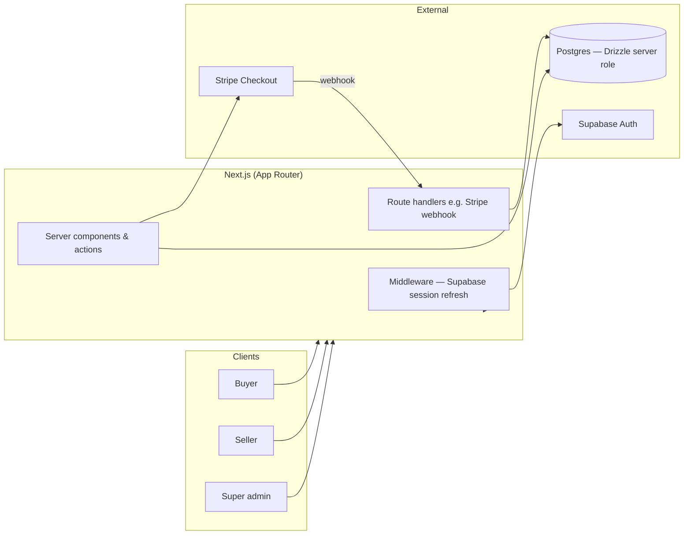

# ShopWell

Multivendor-ready wellness marketplace (AU-focused: **AUD**, compliance-oriented copy). This repo holds the **Next.js** app under `web/`, JSON seed data, and architecture notes.

For local setup, environment variables, Stripe webhooks, and security notes about Supabase RLS, see **[web/README.md](web/README.md)**. The longer design target is in **[architecture.md](architecture.md)**.

## Repository layout

| Path | Purpose |
|------|---------|
| `web/` | Next.js 15 (App Router), Drizzle, Supabase Auth, Stripe Checkout |
| `seed/` | `shopwell.seed.json` and validation helpers for `npm run seed` |
| `architecture.md` | Product/technical architecture (actors, domain, phased payments) |

## System flow

How the main pieces connect at runtime:



Protected areas (`/account`, `/seller`, `/admin`) rely on **Supabase Auth** session from middleware; **application data** in `public` is read/written via **Drizzle** on the server so keys and RLS posture stay safe (see `web/README.md`).

## Checkout sequence (happy path)

End-to-end payment flow as implemented: server action creates a **pending** order and Checkout Session; Stripe confirms payment asynchronously via webhook.

```mermaid
sequenceDiagram
  participant Buyer
  participant Next as Next.js server
  participant DB as Postgres (Drizzle)
  participant Stripe as Stripe

  Buyer->>Next: Submit checkout (cart + shipping)
  Note over Next: createCheckoutSession
  Next->>DB: Insert address, order (pending_payment), line items
  Next->>Stripe: checkout.sessions.create (metadata order_id)
  Stripe-->>Buyer: Redirect to hosted Checkout
  Buyer->>Stripe: Complete payment
  Stripe->>Next: POST /api/webhooks/stripe (checkout.session.completed)
  Next->>Next: Verify signature (STRIPE_WEBHOOK_SECRET)
  Next->>DB: Update order paid / processing; insert payment row
  Buyer->>Next: Land on success URL (e.g. /account/orders)
```

## Scripts (from `web/`)

- `npm run dev` — development server
- `npm run build` / `npm start` — production
- `npm run seed` — auth users + seed JSON
- `npm run test` — Vitest · `npm run test:e2e` — Playwright

## License

Private / not specified in-repo.
