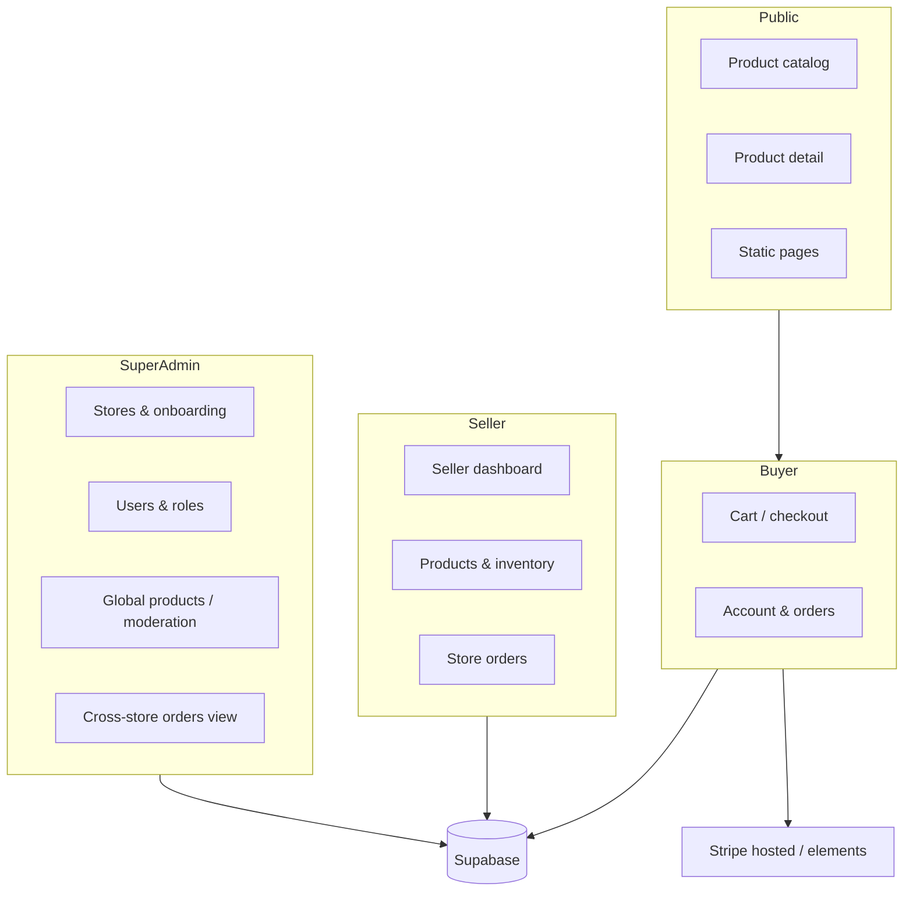
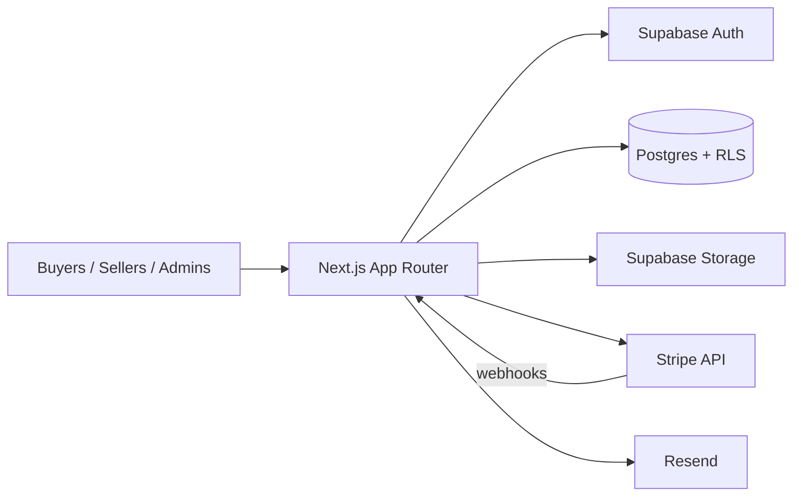
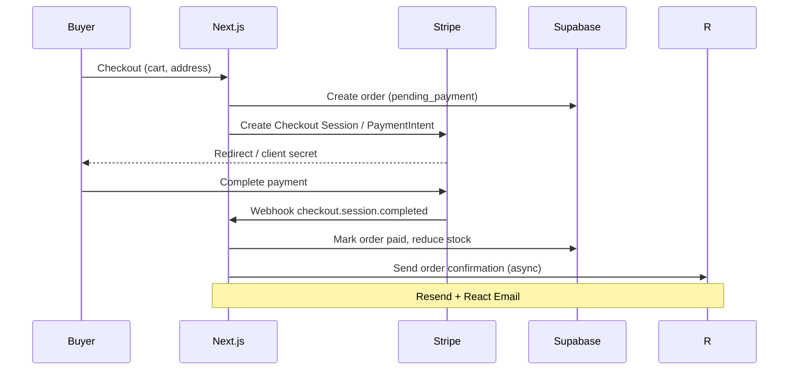
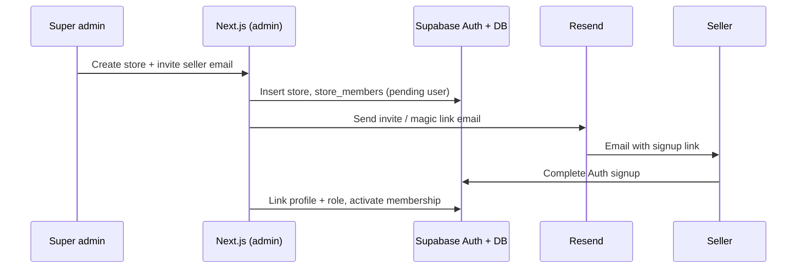
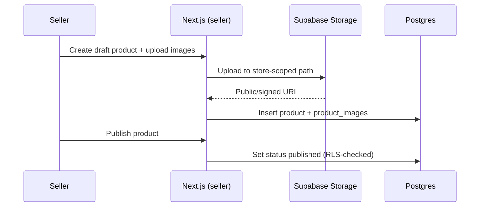
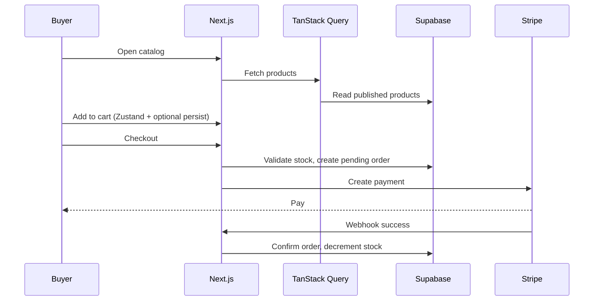
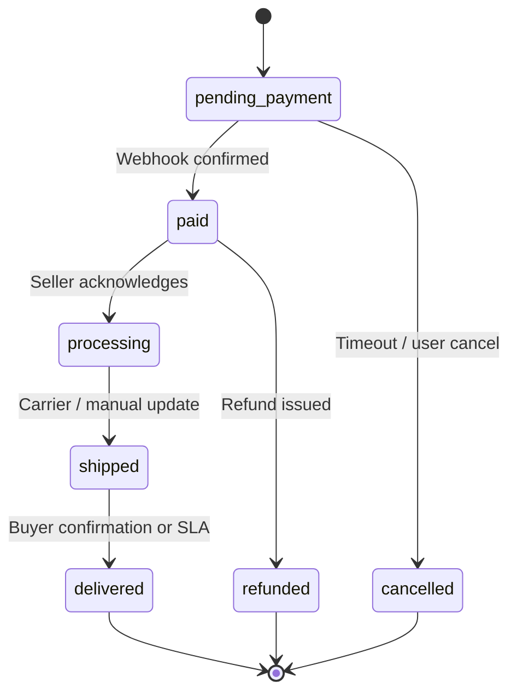

# ShopWell — Technical Architecture

**Product:** ShopWell — a multivendor marketplace for an Australian wellness brand.  
**MVP scope:** Single seeded store, full role model (super admin, seller, buyer), catalog, orders, and standard pages; all domains and copy oriented to AU (currency AUD, privacy/shipping copy placeholders).

This document describes the target system before implementation. Code lives outside this file.

---

## 1. Goals and constraints

| Goal | Notes |
|------|--------|
| Multivendor-ready | Data model and admin UX support many stores; **seed only one store** initially. |
| Clear separation | Super admin, seller portal, buyer account, and public storefront. |
| Trust and compliance | AU-facing wellness context: clear product claims boundaries, privacy policy and terms pages (content TBD). |
| Observable commerce | Orders, payments, and fulfillment status traceable by each role. |

**Non-goals for first implementation pass:** Mobile apps, advanced search (Algolia), multi-region fulfillment logic, native tax engines beyond Stripe/AU defaults documentation.

---

## 2. Tech stack (mandated)

| Layer | Choice |
|--------|--------|
| Framework | **Next.js** (App Router), TypeScript |
| Backend data | **Supabase** — Auth, Postgres, Row Level Security (RLS), **Storage** (product and brand images) |
| ORM / migrations | **Drizzle ORM** against Supabase Postgres |
| UI | **shadcn/ui** + **Tailwind CSS** |
| Client state | **Zustand** (UI/session-adjacent client state); **TanStack Query** (server state, caching, mutations) |
| Forms | **React Hook Form** + **Zod** |
| Payments | **Stripe** (Checkout or Payment Element + webhooks; Connect deferred or flagged as phase 2 — see §7) |
| Email | **Resend** + **React Email** (transactional: order confirmation, seller invites, password reset complements Supabase) |
| Testing | **Vitest** (unit/integration); **Playwright** (E2E critical paths) |

---

## 3. Actors and surfaces

| Actor | Primary routes (illustrative) | Capabilities |
|--------|-------------------------------|--------------|
| **Visitor / buyer** | `/`, `/products`, `/products/[slug]`, `/cart`, `/checkout`, `/account/*`, static pages | Browse, purchase, manage profile and order history. |
| **Seller** | `/seller/*` (or `/dashboard` scoped by role) | CRUD products for **assigned store(s)**, view/update orders for that store, manage inventory fields. |
| **Super admin** | `/admin/*` | Create/edit **stores**, assign **roles** (promote seller, bind user ↔ store), global product/order oversight, feature flags / site config (minimal in MVP). |

Authentication via Supabase; Next.js middleware protects `/admin`, `/seller`, `/account` by server-side session and role claims.

---

## 4. High-level system context

---

## 5. Domain model (conceptual)

Core entities (Drizzle tables — names indicative):

- **`profiles`** — `user_id` (FK to `auth.users`), display name, avatar URL, default address refs, `role` or separate **`user_roles`** for flexibility (recommended: `user_roles` with `role` enum + optional `store_id`).
- **`stores`** — name, slug, description, logo URL, status (`active` | `suspended`), region/currency defaults (AUD).
- **`store_members`** — `store_id`, `user_id`, `member_role` (`owner` | `staff`).
- **`categories`** — hierarchical optional; linked to products.
- **`products`** — `store_id`, title, slug, description, price (cents AUD), status (`draft` | `published` | `archived`), stock quantity (or separate inventory table if needed later).
- **`product_images`** — ordering, `storage_path` or public URL, alt text.
- **`orders`** — `buyer_user_id`, totals, currency, Stripe identifiers, fulfillment status enum, shipping snapshot.
- **`order_items`** — `order_id`, `product_id`, quantity, unit price snapshot, `store_id` (denormalized for multivendor splits).
- **`addresses`** — for billing/shipping snapshots; optional reuse from profile.

**Multivendor note:** Each `product` belongs to one `store`. An order can contain line items from one store in MVP (simplifies shipping and payouts); architecture allows multi-store carts later by keeping `store_id` on each line.

---

## 6. Row Level Security (RLS) principles

- **Buyers:** read published products; CRUD own profile addresses; read/write own cart session (if DB-backed); read own orders.
- **Sellers:** full access to products/order_items where `store_id` is in their `store_members` rows; no access to other stores’ financial detail beyond aggregations if needed.
- **Super admin:** service role or dedicated policy bypass via server-only Supabase client for admin routes (prefer **server actions / Route Handlers** with role check + Supabase admin client for mutations).
- **Storage:** public read for published product assets; write restricted to sellers of that store and admins.

Detailed policies are implemented in SQL migrations alongside Drizzle schema.

---

## 7. Payments (Stripe)

**MVP recommendation:** **Stripe Checkout** (or Payment Element) with a single connected business bank account for the seeded store; record `payment_intent_id` / `session_id` on `orders`.

**Phase 2 (documented, not required day one):** **Stripe Connect** (Express or Standard) per `store` for automated splits and payouts; webhooks for `account.updated`, transfers, and disputes.

---

## 8. Application layering (Next.js App Router)

- **`app/(public)/`** — marketing, catalog, PDP, static legal/info pages.
- **`app/(buyer)/account/`** — orders, profile (session required).
- **`app/(seller)/seller/`** — seller layout; products, orders (role: store member).
- **`app/(admin)/admin/`** — super admin layout; stores, users, global listing.
- **API:** Route Handlers for Stripe webhooks, Resend webhooks if needed, and any server-only mutations that must not be exposed client-side.
- **Server Components** for initial data where possible; **TanStack Query** in client islands for interactive lists and mutations.
- **Zustand** for UI-only state (e.g., cart drawer open, multi-step checkout steps) — optionally backed by TanStack Query persistence for cart sync.

---

## 9. Key sequences

### 9.1 Super admin: create store and attach seller

### 9.2 Seller: publish product with images

### 9.3 Buyer: browse and purchase (happy path)

---

## 10. Order and fulfillment state (conceptual)

Exact enum values are finalized in schema migrations; MVP may collapse to `pending_payment` | `paid` | `fulfilled` | `cancelled` before expanding.

---

## 11. Email templates (React Email + Resend)

| Template | Trigger |
|----------|---------|
| Order confirmation | After successful payment |
| Seller new order | Notify store members |
| Invite / role assignment | Super admin invites seller |
| Password reset | Supabase-native; optional branded wrapper via Resend if custom domain required |

---

## 12. SEO and standard pages

- **Standard pages:** `/about`, `/contact`, `/shipping-returns`, `/privacy`, `/terms` (AU-appropriate placeholders).
- **Catalog SEO:** metadata per product from DB; `sitemap.xml` and `robots.txt` via App Router routes.
- **Structured data:** Product JSON-LD on PDP (optional in first sprint, listed in todo).

---

## 13. Observability and quality

- **Vitest:** Drizzle helpers, pricing math, order total calculations, Zod schemas, role guards.
- **Playwright:** Guest browse → add to cart → checkout (test mode Stripe); seller login → create draft product; admin login → view orders (use test users from seed).
- **Env separation:** `.env.local` for dev; documented vars for Supabase URL/keys, Stripe secret/webhook secret, Resend API key.

---

## 14. Seed data (MVP)

- **One store** (e.g., “ShopWell Wellbeing Co”) with logo and hero imagery in Storage.
- **Users:** one super admin, one seller (store member), one buyer (optional second buyer).
- **Categories:** 3–5 wellness categories.
- **Products:** ~10–15 products with **realistic titles, descriptions, AUD prices**, multiple images each (uploaded to Storage; referenced in `product_images`).
- **Optional:** 1–2 completed orders for demo dashboards (Stripe test mode or marked `paid` manually in seed script).

Seed implemented via Drizzle SQL/TS seed script or Supabase CLI + custom script; idempotent where possible.

---

## 15. Security checklist (implementation)

- Never expose service role key to the browser.
- Validate Stripe webhooks with signing secret.
- CSRF-safe patterns for state-changing Route Handlers where cookies are involved.
- Upload validation: MIME type, max size, filename hygiene; store-scoped paths.
- Rate limiting on auth-sensitive routes (optional: Vercel/Edge middleware or Supabase built-ins).

---

## 16. Open decisions (resolve during build)

1. **Cart persistence:** pure client (Zustand + localStorage) vs. `carts` table for logged-in users — recommend **logged-in DB cart** + guest Zustand with merge on login.
2. **Stripe Connect timing:** MVP single legal entity vs. immediate Connect — default **single entity**; document Connect migration path in `todo.md`.
3. **Product moderation:** super admin approval before `published` vs. seller self-publish — default **self-publish** with admin ability to archive.

---

*End of document — ready for review before implementation.*
